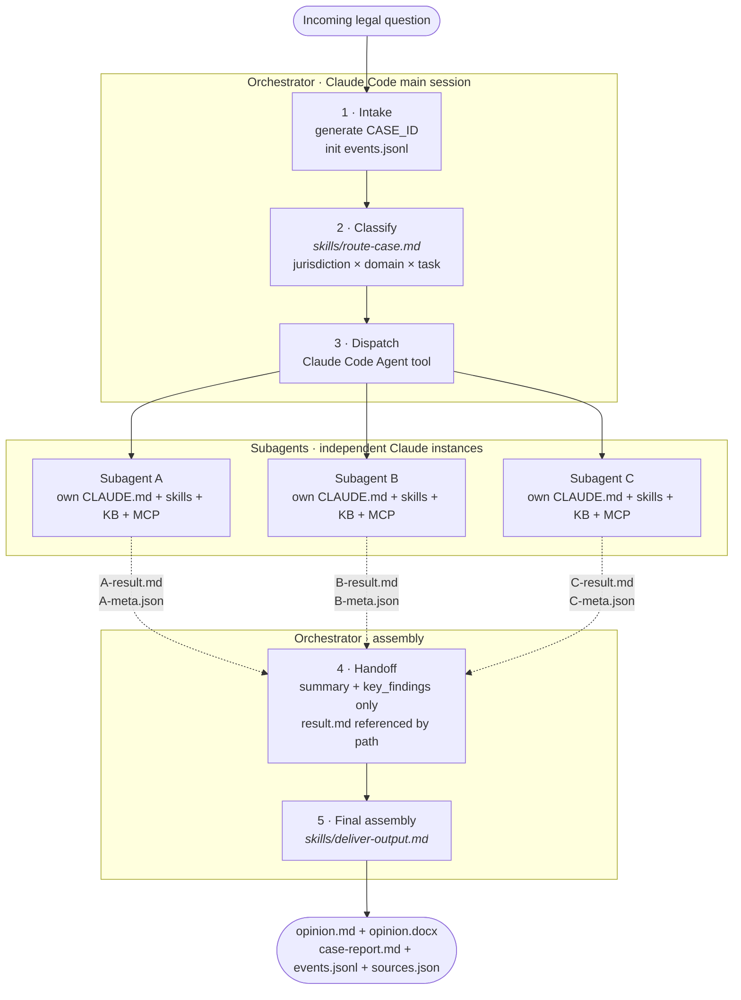

# Legal Agent Orchestrator

A Claude Code-based workflow that routes legal questions to specialist agents. The lead orchestrator classifies each incoming question, dispatches it to the right specialist(s), coordinates hand-offs, and assembles the final work product with a per-case event log.

> Disclaimer: This repository supports legal research, drafting, review, and workflow orchestration. It should not be relied on as a substitute for advice from qualified counsel in the relevant jurisdiction. AI outputs may contain errors, inaccurate citations, or incomplete analysis, and no attorney-client relationship is created through use of this repository.

---

## Agents

Each specialist lives in its own repository as a standalone Claude Code agent. Running `./setup.sh` clones them into `agents/`.

| Specialist | Agent repository | Role |
|----------|------------------|------|
| Legal Research Specialist | [legal-research-agent](https://github.com/lowtidebuild/legal-research-agent) | Source-first legal research (general + game-industry regulation) with four research modes (`general` / `game_regulation` / `game_plus_general` / `fallback`) selected by the orchestrator. |
| Legal Writing Specialist | [legal-writing-agent](https://github.com/lowtidebuild/legal-writing-agent) | Bilingual (KR/EN) drafting for non-contract legal documents, with a tracked-change revision pipeline. |
| Senior Review Specialist | [second-review-agent](https://github.com/lowtidebuild/second-review-agent) | Citation verification against primary legal databases, legal-logic review, and a final release gate. |
| Data Protection Specialist | [data-protection-agent](https://github.com/lowtidebuild/data-protection-agent) | KR PIPA, EU GDPR, and California CCPA/CPRA work with namespaced local knowledge bases. |

> Out of scope: contract review and document translation. Questions classified into those domains receive an `out_of_scope` response without a routed pipeline.

The orchestrator never modifies a subordinate agent's `CLAUDE.md`, skills, or knowledge base. `./setup.sh` shallow-clones each agent's `main` branch and `./setup.sh update` fast-forwards it. Each new case syncs only the agents selected by routing, with a short TTL cache for repeated local runs. Set `LEGAL_ORCHESTRATOR_SKIP_AGENT_SYNC=1` to opt out, `LEGAL_ORCHESTRATOR_FORCE_AGENT_SYNC=1` to ignore TTL, or `LEGAL_ORCHESTRATOR_AGENT_SYNC_TTL_SECONDS=0` to disable TTL caching.

---

## How It Works

A typical pipeline:

| Stage | Agent | Output |
|-------|-------|--------|
| 1. Research | `legal-research-agent` | `{agent}-result.md`, `{agent}-meta.json` |
| 2. Drafting | `legal-writing-agent` | `opinion.md` |
| 3. Review | `second-review-agent` | `review-result.md`, `review-meta.json` |
| 4. Revision rescue | `legal-writing-agent` + orchestrator | `verbatim-verification.md` |
| 5. Delivery | orchestrator | `opinion.docx`, `sources.json`, `case-report.md` |

Every step is appended to `events.jsonl`, and the delivery step folds the case folder into a single `case-report.md`.



### Collaboration patterns

| Pattern | Shape | When |
|---------|-------|------|
| 1 · Parallel research → merge | `[A ∥ B] → writing → review` | Cross-domain or cross-jurisdiction work without debate |
| 2 · Sequential handoff | `A → writing → review` | Single-jurisdiction or focused domain work (default) |
| 3 · Multi-round debate | `[A ∥ B] → rebuttal rounds → transcript → writing verdict → review` | Cross-jurisdiction questions where specialists may disagree |

In Pattern 3, the control plane builds the debate transcript deterministically from round files and decides whether a third round is needed from recorded concessions.

---

## Getting Started

### Prerequisites

- [Claude Code](https://docs.claude.com/claude-code) installed and logged in. A single case can use 200K+ tokens across subagents.
- macOS or Linux with `git`, `bash` or `zsh`, and `python3` (3.10+).
- A [법제처 Open API](https://open.law.go.kr/) account (free). The resulting `LAW_OC` key lets the `korean-law` MCP server query Korean statutes, precedents, and administrative interpretations.

### 1. Clone the orchestrator

```bash
git clone https://github.com/lowtidebuild/legal-agent-orchestrator.git
cd legal-agent-orchestrator
```

### 2. Install the subordinate agents

```bash
./setup.sh
```

This shallow-clones the four specialist repositories into `agents/` under their agent IDs, tracking each one's `main` branch:

```
agents/
├── legal-research-agent/
├── legal-writing-agent/
├── second-review-agent/
└── data-protection-agent/
```

Each folder is an independent Claude Code agent with its own `CLAUDE.md`, `skills/`, knowledge base, and MCP configuration. The orchestrator dispatches cases via Claude Code's `Agent` tool with `cwd: agents/{agent-id}/`.

Other `setup.sh` commands:
- `./setup.sh update [agent-id ...]` — fast-forward every agent (or only the listed ones) to the latest upstream `main`
- `./setup.sh status [agent-id ...]` — compare each agent's local SHA against upstream
- `./setup.sh link [agent-id ...]` — development mode: symlink local checkouts instead of cloning

During case execution the orchestrator resolves route-specific sync targets with `scripts/resolve-sync-targets.py` and applies TTL-aware sync with `scripts/sync-agents.py`.

### 3. Set your Korean Open Law API key

```bash
export LAW_OC=your_law_oc_key
```

Required every shell session — Claude Code does not auto-load `.env`. Putting the export in `~/.zshrc` or `~/.bashrc` is the simplest option.

### 4. Launch Claude Code from the orchestrator directory

```bash
claude
```

Claude Code auto-loads [CLAUDE.md](CLAUDE.md) (the orchestrator system prompt), `.mcp.json` (MCP servers, inherited by subagents on dispatch), and `skills/*.md`. Ask a legal question in Korean or English.

### 5. Find your results

```
$OUTPUT_DIR/  # defaults to output/{CASE_ID}/
├── events.jsonl            ← full timeline, one event per line
├── {agent}-result.md       ← each subagent's detailed analysis
├── {agent}-meta.json       ← compact summary + issue map + graded sources
├── sources.json            ← merged source table with grade distribution
├── opinion.md              ← final opinion in markdown
├── debate-opinion.md       ← Pattern 3 verdict, when debate is used
├── debate-transcript.md    ← debate transcript, when debate is used
├── case-report.md          ← single-file narrative case archive
└── opinion.docx            ← final opinion as DOCX
```

Set `LEGAL_ORCHESTRATOR_PRIVATE_DIR` to write case files outside the repository.

`case-report.md` is generated automatically at delivery; for a completed case it can also be generated manually:

```bash
python3 scripts/generate-case-report.py "$OUTPUT_DIR"
```

### Smoke checks

Before committing orchestrator changes, run the checks in [CONTRIBUTING.md](CONTRIBUTING.md):

```bash
python3 -m pytest
python3 scripts/sanitize-check.py --self-test
python3 scripts/smoke-check.py
```

---

## Project Structure

```
legal-agent-orchestrator/
├── CLAUDE.md                           # orchestrator system prompt
├── .mcp.json                           # MCP server config (korean-law + kordoc)
├── .github/workflows/                  # CI and scheduled maintenance workflows
├── setup.sh                            # shallow-clone / update / link commands for subordinate agents
├── CONTRIBUTING.md                     # local smoke-check workflow
├── MCP_VERSION_CHANGELOG.md            # MCP pin and smoke-test history
├── legal-writing-formatting-guide.md   # canonical legal opinion style guide
├── pytest.ini                          # restricts pytest collection to orchestrator tests
├── skills/
│   ├── route-case.md                   # classification + pipeline selection
│   ├── deliver-output.md               # final assembly + case-report generation handoff
│   ├── generate-case-report.md         # single-file case archive generation
│   ├── manage-debate.md                # Pattern 3 debate orchestration
│   └── prompt-templates/               # reusable dispatch prompt blocks
├── scripts/                            # logging, routing, validation, delivery, and check scripts
├── schemas/                            # JSON schemas for events, meta, routing, review
├── tests/                              # unit tests and fixture cases
├── agents/                             # 4 subordinate agents (gitignored, populated by setup.sh)
└── output/                             # live case artifacts (gitignored)
```

---

## License

Apache License 2.0 — see [LICENSE](LICENSE).

Subordinate agents are hosted in separate repositories with their own licenses. Legal data comes from Korean Ministry of Government Legislation public APIs and court judgments (public-domain government works).
